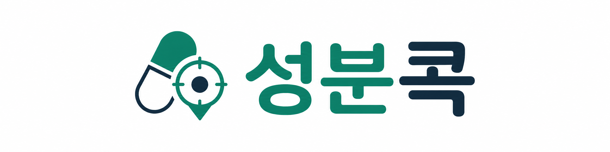
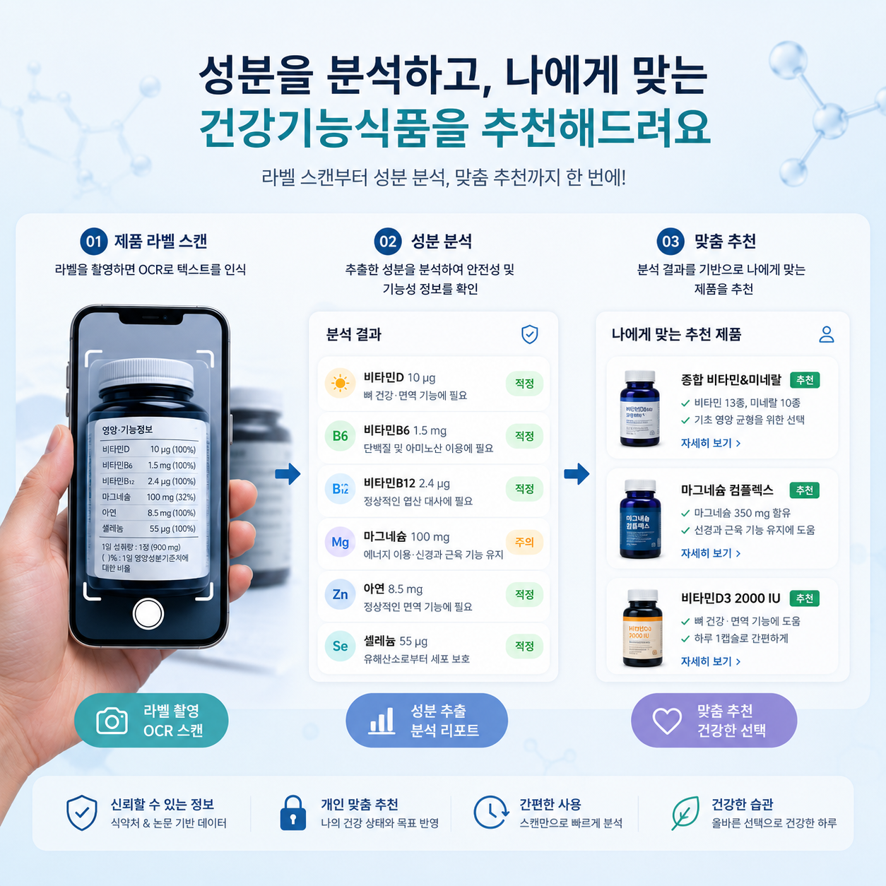
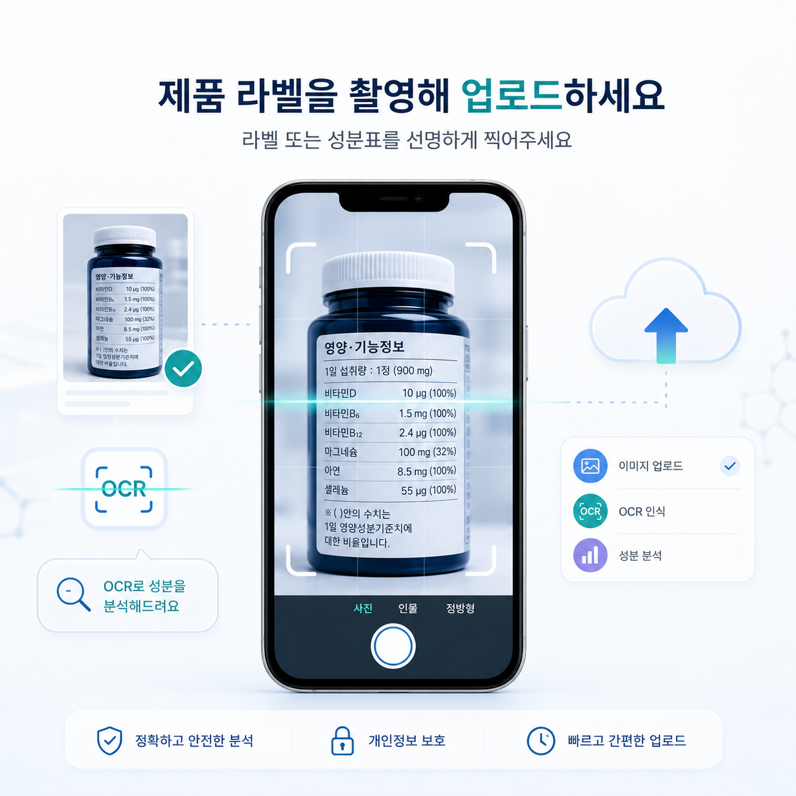
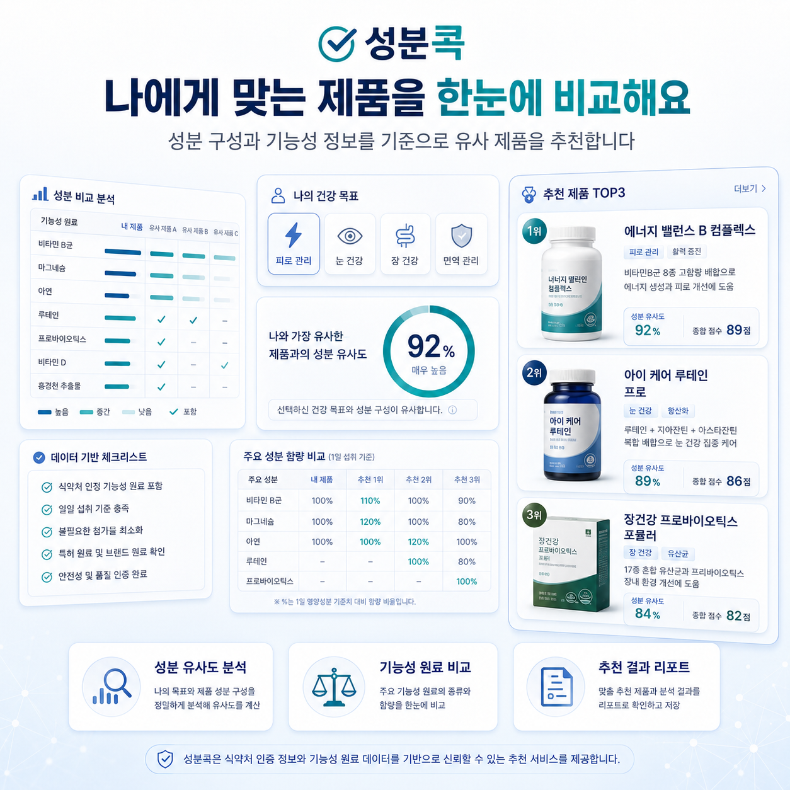
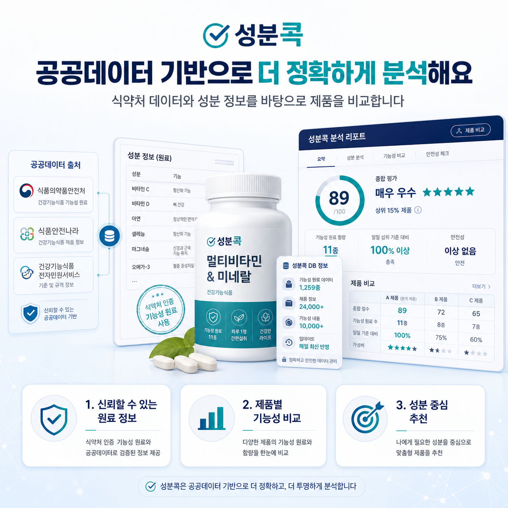

<div align="center">
  

  <h1>성분콕 — 건강기능식품 성분 분석 · 추천 플랫폼</h1>

  <p>
    라벨 한 장을 촬영하면, AI가 원료를 정밀 분석하고<br/>
    공공데이터 기반으로 나에게 맞는 제품을 추천해드립니다.
  </p>

  <p>
    
    
    
    
    
  </p>
</div>

---

## 주요 화면

<table>
  <tr>
    <td align="center">
      
      <b>메인 화면</b><br/>라벨 스캔 → 성분 분석 → 맞춤 추천 3단계
    </td>
    <td align="center">
      
      <b>라벨 업로드</b><br/>제품 라벨 촬영 후 OCR 자동 인식
    </td>
  </tr>
  <tr>
    <td align="center">
      
      <b>추천 결과</b><br/>유사도 92% 이상 제품 한눈에 비교
    </td>
    <td align="center">
      
      <b>공공데이터 분석</b><br/>식약처 공공데이터 기반 정밀 성분 비교
    </td>
  </tr>
</table>

---

## 핵심 기능

### 📸 라벨 OCR 분석
- Google Vision API로 제품 라벨 이미지에서 성분표 자동 추출
- LLM 기반 파싱으로 원료명 정규화 및 함량 구조 파악
- 부형제·캡슐 기제 자동 분리, 주요 기능성 원료만 추출

### 🔬 원료 정밀 매칭
- 2단계 매칭: **캐시 DB 조회** → **RAG + GPT 매칭** 순서로 최적 표준 원료 검색
- `ingredient_match_cache` SQLite에 검증된 매핑 누적 저장으로 반복 비용 최소화
- 잘못된 `same_function_only` 매핑 자동 차단 (예: 아로니아 → 참깨박 오매칭 방지)
- 비타민 제제·칼슘 분말 등은 `nutrient_form` 으로 정확 분류

### 🤝 의미론적 유사도 알고리즘 `semantic_weighted_jaccard_v2_13`
- 원료별 IDF 가중치, 기능성 카테고리 정렬, 역할(primary/secondary/support) 가중치를 결합한 커스텀 Jaccard 유사도
- 단일 원료 제품이 복합 원료 제품에 과도하게 매칭되지 않도록 **발산 타깃 점수 상한** 적용
- 80,000건 이상 배치 평가 결과 high-score weak 비율 **1.31%** (목표 < 2%)

### 📊 공공데이터 연계
- 식약처 기능성 원료 고시 데이터베이스와 연동
- 기능성 인정 여부, 기능성 내용, 원료 표준명 기반 카테고리 분류

### 👤 개인화 추천
- 업로드 제품 프로필 ↔ 데이터베이스 전 제품 벡터 유사도 실시간 계산
- 기능 유사도, 원료 유사도, 카테고리 일치도 종합 점수화
- 동일 원료 기반 / 인접 카테고리 / 대체 가능 제품 3-tier 분류

---

## 기술 스택

| 구분 | 기술 |
|------|------|
| **API 서버** | FastAPI, Uvicorn |
| **OCR** | Google Cloud Vision API |
| **LLM** | OpenAI GPT-4o-mini (Batch API 활용) |
| **임베딩** | OpenAI Embeddings (RAG 검색용) |
| **데이터베이스** | SQLite (WAL 모드), Pandas |
| **유사도 엔진** | 커스텀 Semantic Weighted Jaccard v2.13 |
| **인프라** | AWS EC2, Python 3.10+ |

---

## 프로젝트 구조

```
medicine_similarity/
├── api/                                # FastAPI 애플리케이션
│   ├── main.py                         # 라우터 진입점
│   ├── upload_recommendation_service.py # 업로드·추천 오케스트레이터
│   ├── ingredient_match_constants.py   # 매칭 상수 모음
│   ├── ingredient_match_guards.py      # 정규화·가드 유틸리티
│   ├── request_progress.py             # 실시간 진행상태 트래킹
│   ├── ingredient_parse_service.py     # OCR 텍스트 파싱
│   ├── ingredient_match_llm_client.py  # GPT 원료 매칭 클라이언트
│   ├── ingredient_embedding_index.py   # RAG 임베딩 인덱스
│   ├── recommendation_service.py       # 추천 로직
│   ├── ocr_service.py                  # Google Vision OCR
│   ├── ingredient_family.py            # 원료 계열 분류
│   ├── product_search_service.py       # 제품 검색
│   ├── ops_service.py                  # 인증·운영
│   ├── config.py / db.py / schemas.py  # 설정·DB·스키마
│   └── templates/                      # Jinja2 HTML 템플릿
├── scripts/                            # 데이터 파이프라인 스크립트
│   ├── enhance_similarity_with_explanation.py  # 유사도 알고리즘 핵심
│   ├── build_ingredient_match_cache_v2.py      # 매칭 캐시 구축
│   ├── build_functional_category_map.py        # 기능성 카테고리 매핑
│   ├── recommendation_quality_judge_batch.py   # 배치 품질 평가
│   └── run_recommendation_quality_eval.py      # 품질 지표 계산
├── tests/                              # pytest 테스트
├── docs/
│   └── assets/                         # README 이미지
└── config.example.json                 # 설정 예시
```

---

## 시작하기

### 1. 환경 설정

```bash
git clone https://github.com/genius1998/medicine_similarity.git
cd medicine_similarity
python -m venv .venv
source .venv/bin/activate  # Windows: .venv\Scripts\activate
pip install -r requirements_api.txt
```

### 2. 설정 파일 준비

```bash
cp config.example.json config.json
# config.json 에서 sqlite_path, Google OCR 키 경로, auth 비밀번호 수정
```

`.env` 파일 생성:

```env
OPENAI_API_KEY=sk-...
GEMINI_API_KEY=...   # 선택
```

### 3. 기능성 원료 DB 구축 (최초 1회)

```bash
python scripts/build_functional_category_map.py
python scripts/build_ingredient_match_cache_v2.py
```

### 4. 서버 실행

```bash
uvicorn api.main:app --host 0.0.0.0 --port 8000 --reload
```

브라우저에서 `http://localhost:8000` 접속

---

## API 엔드포인트

| 메서드 | 경로 | 설명 |
|--------|------|------|
| `POST` | `/api/upload-recommend` | 이미지 업로드 → OCR → 추천 |
| `POST` | `/api/ingredient-recommend` | 원료 리스트 직접 입력 → 추천 |
| `POST` | `/api/ocr-text-recommend` | OCR 텍스트 → 추천 |
| `GET`  | `/api/products/search` | 제품명 검색 |
| `GET`  | `/api/products/{id}/profile` | 제품 상세 프로필 |
| `GET`  | `/api/request-progress/{id}` | 분석 진행상태 폴링 |

---

## 원료 매칭 알고리즘

원료 정밀 매칭은 두 단계로 진행됩니다:

```
입력 원료명
    │
    ▼
① 캐시 DB 조회 (ingredient_match_cache)
    │  exact → normalized_raw 순으로 탐색
    │  same_function_only / unrelated / unknown / error / excipient → 차단
    │
    ▼ (캐시 미스 또는 non-functional)
② RAG + GPT 매칭
    │  상위 K 후보 임베딩 검색 → GPT-4o-mini로 relation_type 판정
    │  same_ingredient / nutrient_form / ingredient_group / marker_compound → 수락
    │
    ▼
표준 원료명 + 기능성 카테고리
```

`relation_type` 정의:

| 타입 | 의미 | 벡터 반영 |
|------|------|-----------|
| `same_ingredient` | 동일 원료 | ✅ |
| `nutrient_form` | 형태 다른 동일 영양소 (혼합제제 등) | ✅ |
| `ingredient_group` | 상위 원료 그룹 | ✅ |
| `marker_compound` | 지표 성분으로 동일 원료 확인 | ✅ |
| `same_function_only` | 같은 기능군이나 다른 원료 | ❌ 차단 |
| `unrelated` / `unknown` | 관련 없음 / 미확인 | ❌ 차단 |

---

## 품질 검증

OpenAI GPT-4o-mini Batch API로 추천 품질을 정기 평가합니다:

- **Judge 레이블**: `reasonable` / `acceptable_adjacent` / `weak` / `bad`
- **품질 게이트**: `high_score_weak_or_bad_rate < 2%`
- **최신 결과** (80,388 행 누적): hs_weak = **1.31%** ✅

```bash
# 품질 평가 실행
python scripts/run_recommendation_quality_eval.py --category 피로개선
python scripts/recommendation_quality_judge_batch.py  # 배치 제출
```

---

## 테스트

```bash
pytest tests/ -q
```

119개 테스트 전부 통과. 주요 커버리지:

- `test_upload_ingredient_matching.py` — 원료 매칭 캐시·RAG 통합 테스트
- `test_similarity_weighting.py` — 유사도 알고리즘 가중치 단위 테스트
- `test_ocr_ingredient_parsing.py` — OCR 파싱 엣지케이스
- `test_ingredient_catalog_lookup.py` — 기능성 카테고리 매핑 테스트

---

## 라이선스

Private — 무단 복제 및 배포 금지

---

<div align="center">
  <sub>Powered by FastAPI · OpenAI · Google Cloud Vision</sub>
</div>
